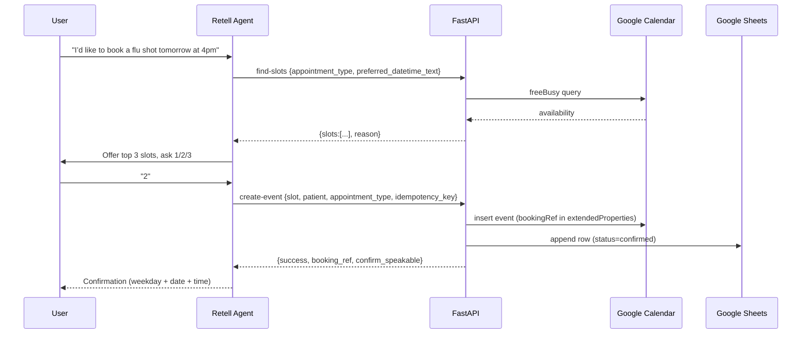
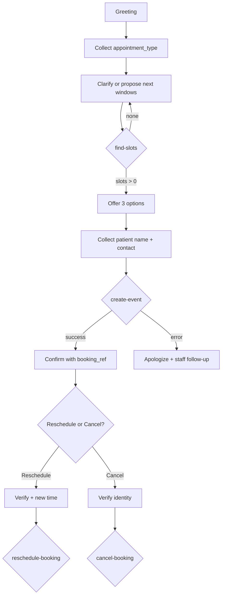

# Community Pharmacy Booking Assistant

A voice-ready assistant built on **RetellAI + FastAPI**, integrated with **Google Calendar** (availability & events) and **Google Sheets** (audit log). It supports **booking**, **rescheduling**, and **cancellation** using natural-language dates/times.

---
**Repo:** <https://github.com/Anushkasethi/pharmacy-booking>  
---

## 1. Architecture & Key Components

1. **Retell Agent (chat)**
   - Drives the dialogue, stores dynamic variables, and calls custom functions.

2. **FastAPI service (custom functions)**
   - `POST /find-slots` — natural-language availability.
   - `POST /create-event` — create Calendar event + log to Sheets.
   - `POST /reschedule-booking` — move an existing booking.
   - `POST /cancel-booking` — cancel Calendar event, update Sheets.

3. **Google Calendar**
   - Free/busy checks and event lifecycle.
   - Idempotency via `extendedProperties.private.bookingRef`.

4. **Google Sheets**
   - Human-readable audit trail (status: `confirmed`, `rescheduled`, `cancelled`).

---

## 2. Data Flow (Sequence)


---

## 3. Conversation Flow


---

## 4. Tools & Libraries (Why)

- **RetellAI** — chat that can graduate to voice; function calling + dynamic variables.  
- **FastAPI + Pydantic** — fast iteration and strict payload validation.  
- **Google Calendar API** — real availability and robust event operations.  
- **Google Sheets API** — simple, transparent audit log for staff.  
- **python-dateutil, pytz** — reliable parsing and timezone handling.

---

## 5. Error-Handling Approach

- **Validation:** Pydantic returns
  ```json
  {"success": false, "error": "validation_error", "reason": "..."}
  ```
- **Calendar/Sheets exceptions:** caught and surfaced; agent replies with a short apology and offers staff follow-up.  
- **Busy slots:** up to three alternatives returned; agent asks the user to pick **1/2/3**.  
- **Idempotency:** `create-event` with the same details returns the existing event (no duplicates).  
- **Ref robustness:** `normalize_booking_ref` (trim, uppercase, normalize Unicode dashes) plus fallback to **name+contact** lookup.

---

